# Proposal: Alpha Kubernetes Topology-Aware Scheduling in KubeRay

Status: working design for community discussion. This is an **alpha, opt-in** feature.
Companion: [discussion issue draft](topology-aware-scheduling-issue.md).
Prototype: [results on Kubernetes v1.37](topology-aware-scheduling-prototype/README.md).

## Assumptions

- **[PR #5266][preemption-pr] has merged.** This proposal is written on top of it. If it
  changes before merging, the affected sections are marked *(#5266)*. Concretely, it assumes:
  - One Workload and one PodGroup (`<raycluster>-cluster`) per RayCluster.
  - Autoscaling RayClusters are gang scheduled at a floor of one head plus each worker
    group's `minReplicas`. Pods above the floor schedule individually.
  - `gang.minCount` is the only field updated in place. Any other drift is not reconciled;
    the user recreates the RayCluster.
  - KubeRay copies the head pod template's `priorityClassName` and (if set)
    `preemptionPolicy` onto the Workload and PodGroup. It does not look up PriorityClasses,
    needs no extra RBAC, and has no feature gate of its own for this.
  - The operator does not do Kubernetes version/feature-gate detection beyond the existing
    `scheduling.k8s.io/v1alpha3` discovery check.
- Target is Kubernetes v1.37 alpha behavior. The KEPs' moving `master` documents include
  later beta work that must not be assumed.
- No concrete cluster, topology keys, manifest, or benchmark exists yet. Examples are
  illustrative and make no performance claim.

## Summary

Let a RayCluster ask Kubernetes to co-locate each worker group in a topology domain
(for example one rack) using Kubernetes topology-aware workload scheduling
([KEP-5732][tas-kep]), while still admitting the whole cluster as one gang.

To do that without forcing the head into the workers' domain, a RayCluster that requests
topology is mapped to a native CompositePodGroup ([KEP-6012][composite-kep]):

- A root CompositePodGroup is a gang that requires every child. It has no topology.
- A head PodGroup (`minCount: 1`) has no topology.
- One PodGroup per participating worker group has an optional single topology key.

Kubernetes selects domains; KubeRay never selects nodes. RayClusters that do not request
topology keep the single-PodGroup layout from #5266 unchanged.

## What the #5266 Review Taught Us

| Reviewer concern on #5266 | Effect on this design |
| --- | --- |
| Support only mutable fields in place (`gang.minCount`); everything else is immutable. | Only leaf `minCount` is patched. Layout, topology, and priority are fixed at creation; changes require recreating the RayCluster. No drift-detection or replace-in-place machinery. |
| Don't add feature gates or RBAC that the code does not need. | No new KubeRay feature gate. The existing `KubernetesWAS` gate plus per-RayCluster opt-in is enough. The only new RBAC is `compositepodgroups`, next to the existing Workload/PodGroup rules. |
| Don't look up or "fix up" Kubernetes-owned fields; admission owns them. | Reuse #5266's approach: copy the head's `priorityClassName`/`preemptionPolicy` verbatim to every group; no lookups. |
| Validate against the real Kubernetes source and a kind run, not assumptions. | A kind fixture and manual test steps are part of the deliverable, and each upstream assumption below is checked in a prototype first. |
| Make single-group assumptions explicit in code. | The one-group assumption in `syncWorkload`/`syncPodGroup` is replaced by a leaf list. The remaining assumption (fixed layout) is documented in code. |
| Keep existing behavior for unrelated paths (finalizer handling, terminating PodGroups). | Keep #5266's finalizer and terminating-group behavior for leaves; verify composites separately. |
| Fail fast on unsupported platforms. | Before creating pods, error if a topology request cannot be honored: the WAS plugin or gang label is missing, `compositepodgroups` is not served, or persisted constraints were dropped. |

## Opt-In Model

Both sides must opt in. There is no implicit migration.

| Side | Opt-in |
| --- | --- |
| Kubernetes cluster | v1.37 with `scheduling.k8s.io/v1alpha3` and `v1beta1` served, and `GenericWorkload`, `TopologyAwareWorkloadScheduling`, and `CompositePodGroup` enabled on kube-apiserver and kube-scheduler. Nodes carry accurate topology labels. |
| KubeRay operator | Existing `KubernetesWAS` feature gate (no new gate). |
| RayCluster | Existing `ray.io/gang-scheduling-enabled: "true"` label **and** a topology request on at least one worker group (below). |

A RayCluster with the gang label but no topology request is scheduled exactly as in #5266
(one flat PodGroup). This removes any migration or legacy-resource story for existing
WAS users: nothing changes for them until they add a topology request.

Gate dependencies in v1.37 (`CompositePodGroup` depends on `TopologyAwareWorkloadScheduling`,
which depends on `GenericWorkload`) are Kubernetes-side facts. KubeRay cannot read the
scheduler's gates or profile, so enabling them is documented as an administrator responsibility.

## Kubernetes Contract (v1.37 alpha)

- A Workload holds `compositePodGroupTemplates[]`; each composite template has child
  `podGroupTemplates` (at most eight) and the controller creates matching runtime
  CompositePodGroup and PodGroup objects. Template depth is at most four; this design uses two.
- `PriorityClassName` and `PreemptionPolicy` exist on composite and leaf templates and
  runtime objects, so #5266's priority handling extends to the hierarchy.
- Topology is `schedulingConstraints.topology[]` with at most one entry (a label key) per
  group. It is a hard co-location requirement: all pods of the group use nodes with the
  same value for the key. It is not a spread policy or a preference with fallback.
  Siblings using the same key are not required to share a value.
- `schedulingConstraints` is immutable. A composite's `schedulingPolicy` (including
  `minGroupCount`) and parent/workload references are immutable. Leaf gang `minCount` is mutable.
- Scheduling candidates are restricted to placements containing already-scheduled members of
  the same group, so growth or replacement of a worker group stays in its chosen domain.
- Gang admission is not an application-start barrier, health guarantee, or atomic bind.
- Existing pod constraints (resources, affinity, taints, volumes) still apply. Capacity is
  needed inside one domain, not in aggregate.

These come from the KEPs and v1.37 API types. The [prototype](topology-aware-scheduling-prototype/README.md)
checked them on a real v1.37.0 cluster; the results are summarized next.

### Prototype Findings (Kubernetes v1.37.0, hand-built objects)

| Question | Finding | Design impact |
| --- | --- | --- |
| Can the head sit outside worker domains, with distinct per-leaf constraints and an unconstrained leaf? | Yes. | The selected layout works as proposed. |
| Does an infeasible leaf, or an infeasible head, block the whole gang? | Yes: nothing binds, including the head and the feasible siblings. Once capacity appears it is admitted automatically, after tens of seconds. | Matches the intended all-or-nothing semantics. Document the delay. |
| Can leaves schedule independently if the hierarchy is incomplete? | No; nothing bound until root and all leaves existed. | Parent-first creation is safe, and partial creation is harmless. |
| Does the API validate hierarchy consistency? | No: a leaf with a missing parent or unknown template name is accepted. | KubeRay must create in order and verify; do not rely on the API. |
| Which fields are mutable? | Leaf `minCount` (runtime and template). Constraints, parent references, and the root's `minGroupCount` are immutable. `minCount: 0` is rejected. | Confirms the `minCount`-only update stance and the floor-zero deferral. |
| Do pods above the floor and replacements stay in the domain? | Added pods landed in the group's existing rack; a pod beyond the rack's capacity stayed Pending although the other rack was free. | Confirms the lifecycle bullet. Document it as a limitation. |
| Is a single common priority required? | Yes. One pod with a different priority blocked the entire gang, head included. A `priorityClassName` on the root, leaves, and pods resolved consistently. | Copy the head's values to every group and document the uniform-priority requirement. |
| Does the root CompositePodGroup report status? | No: its `status` stays empty in v1.37. Leaf PodGroups report `PodGroupInitiallyScheduled`. | Observe admission on the leaves. |
| Which objects carry finalizers? | Only leaf PodGroups (`scheduling.k8s.io/podgroup-protection`); Workload and CompositePodGroup have none. Owner-reference GC removed everything. | Keep #5266's finalizer handling for leaves only. |
| What happens with missing gates? | apiserver off: `compositepodgroups` not in discovery, and PodGroup `schedulingConstraints` silently dropped. Scheduler off, apiserver on: everything persisted but the constraint was **not enforced**. | Discovery and persisted-constraint checks are worthwhile. Scheduler gates cannot be detected; they remain an administrator prerequisite. |
| Is the scheduler's greedy sibling placement a problem? | Yes, reproduced in e2e. A feasible layout stayed blocked because an unconstrained sibling group evidently took capacity in the only domain that fits a constrained one; it scheduled once that domain had one more slot. The earlier hand-built attempts did not trigger it. | Document it as a limitation: unconstrained groups can strand a topology gang. Needs SIG Scheduling input; KubeRay cannot reorder siblings today. |

The operator prototype (branch `tas-prototype`) then built this layout from the annotation on the
same cluster. It confirmed: correct hierarchy and per-leaf placement, in-place `minCount` patching
with unchanged UIDs, autoscaling floors, a fail-fast error with no objects or pods created for each
invalid request, rejection of structural changes, whole-cluster blocking, cleanup, and unchanged
behavior for RayClusters without the annotation, including on a cluster that does not serve
`compositepodgroups`. See the [results](topology-aware-scheduling-prototype/README.md).

Nine operator e2e tests were then added to the existing WAS e2e suite. The kind configs now enable the
two gates and have two labeled workers (two racks and zones); with them the full suite passes (29 of
29). Three of the tests check multi-domain placement with exact, test-controlled capacity: each group
in its own domain, a group that fits no domain blocking the whole gang, and growth staying in the
domain. They also surfaced the greedy sibling-placement behavior above.

Not covered by the prototype: RayJob and RayService, `preemptionPolicy` enforcement, multi-host
groups, node loss and replacement, and scale.

## Design

### Resource Mapping

```mermaid
flowchart TD
  root["Root CompositePodGroup: Gang, minGroupCount = 1 + leaves, no topology"]
  head["Head PodGroup: Gang minCount=1, no topology"]
  train["Worker group training: Gang minCount=floor, rack topology"]
  data["Worker group data: Gang minCount=floor, no topology"]
  root --> head
  root --> train
  root --> data
```



| Object | Value |
| --- | --- |
| Workload | One per RayCluster (same name as today); one root entry in `compositePodGroupTemplates`, no top-level `podGroupTemplates`. |
| Root | Name `<raycluster>-cluster`. Gang with `minGroupCount` = 1 head + number of worker leaves. No topology. |
| Head leaf | Name `<raycluster>-head`, `minCount: 1`, no topology. |
| Worker leaf | Name `<raycluster>-wg-<groupName>`. `minCount` = that group's gang floor (below). Copies only that group's topology key. |
| Pods | Every Ray pod's `spec.schedulingGroup.podGroupName` is its own leaf, never the root. |
| Priority | Head template's `priorityClassName`/`preemptionPolicy` copied to root and every leaf *(#5266)*. All Ray pods must use the same PriorityClass; documented as in #5266. |
| Ownership | RayCluster is the controller owner of all objects. |

Gang floor per worker leaf is `minReplicas * numOfHosts` when the Ray autoscaler is enabled
and `replicas * numOfHosts` otherwise, matching the whole-cluster floor from #5266.
Every leaf must have `minCount >= 1`.

Objects are created in dependency order: Workload, root, leaves, then pods. Pods are not
held back until the head is Ready; the parent gang needs all members to exist.

### API (Alpha)

Topology is requested with a RayCluster annotation that maps worker group names to label keys:

```yaml
metadata:
  labels:
    ray.io/gang-scheduling-enabled: "true"
  annotations:
    ray.io/worker-group-topology: |
      {"training": "topology.example.com/rack", "data": "topology.kubernetes.io/zone"}
```

Why an annotation rather than a CRD field: this is an alpha with an unsettled upstream API.
An annotation needs no CRD, generated-client, Helm-schema, or apiserver changes, follows the
existing label-based opt-in, and can be removed without a compatibility burden. A typed
`workerGroupSpecs[].scheduling.topology.key` field is the intended graduation path once the
upstream API stabilizes. Groups not named in the map still join the gang, without topology.

Validation (reconcile-time errors before any pod is created; no silent fallback to ordinary
scheduling):

- **Activation check:** if the RayCluster carries the topology annotation, the WAS batch
  scheduler must be enabled and selected and the RayCluster must have the gang label. Otherwise
  return an actionable error before creating pods, so a hard placement request is never
  silently dropped. This runs in the controller's pod reconciliation, before the optional
  batch-scheduler branch (the WAS plugin is never called when `KubernetesWAS` is off).
  RayClusters without the annotation are untouched.
- The annotation is valid JSON, every key is a valid Kubernetes label key, and every name
  matches an existing worker group.
- The head plus participating worker groups fit in the eight-template limit
  (head + at most seven worker groups). Larger clusters are rejected.
- A group named in the map has a gang floor of at least one.
- Derived object names are valid and within length limits.
- `compositepodgroups` is served by the API server (checked through discovery), and the
  persisted Workload and leaf PodGroup still contain the requested topology constraint. If
  they do not, report the configuration problem instead of creating pods or looping on
  delete/recreate. The prototype showed the API can silently drop the constraint when the
  apiserver gates are off.
- Created objects match the desired hierarchy (parents, template names). The API does not
  validate this, so KubeRay creates in dependency order and verifies.

Participating worker groups are those with a floor of at least one at creation. Groups with
a floor of zero (suspended, zero replicas, or autoscaling `minReplicas: 0`) get no leaf;
their pods are not in a gang and cannot have a topology request.

Supporting floor-zero groups is deferred until `minGroupCount` is mutable (beta, targeted
for v1.38), rather than worked around in alpha. In v1.37 alpha:

- A leaf gang needs `minCount >= 1`, and gang/basic cannot be changed after creation. A
  basic leaf under a gang root is an invalid hierarchy, so a zero-floor group cannot be a
  basic leaf.
- The root's children and `minGroupCount` are immutable. `minGroupCount` means "at least N
  admissible children", not specific ones, so optional leaves could mask a missing required
  group, and a required group dropping to zero pods would stop the scheduler from admitting
  new pods for its siblings.

A mutable `minGroupCount` lets KubeRay change the required-group count at runtime, which is
the clean way to support groups that scale to or from zero, suspend, or are added later.
Revisit once the beta behavior is available and verified.

### Lifecycle

- **Create:** build the whole tree and create it before pods.
- **Resize/autoscale:** patch each leaf's `minCount` in the Workload template and runtime
  PodGroup in place, like #5266. The root is untouched because its leaf count does not change.
  Pods above the floor join their leaf and (prototype-confirmed) land in that group's existing
  domain; if that domain is full they stay Pending even when other domains are free.
- **Anything else is unsupported after creation:** adding, removing, or renaming worker groups,
  changing the topology annotation, a group's floor crossing zero, or changing PriorityClass.
  KubeRay reports an actionable error and does not delete/recreate scheduling objects.
  The user recreates the RayCluster. This matches #5266's only-`minCount` stance.
- **Whole-cluster suspend/resume:** retain the objects and recreate pods, as in #5266. Each
  worker group may land in a new domain once its previous pods are gone.
- **Cleanup:** garbage collection via owner references, plus explicit bottom-up deletion
  (leaves, then root, then Workload) where the provider deletes explicitly. Keep #5266's
  protection-finalizer handling for leaf PodGroups only: in v1.37 the Workload and
  CompositePodGroup have no finalizers (prototype), and owner-reference GC removed everything.
- **RayJob/RayService:** works only when the label and annotation reach the generated
  RayCluster; no extra work is planned. No special rollout handling.

### Operator Changes

- Add `compositepodgroups` to the WAS RBAC (Helm, kustomize, and role manifests) under the
  existing `KubernetesWAS` gating, and register them with `Owns(...)` in `ConfigureReconciler`.
- Add a composite builder alongside the flat one; select by "has a valid topology request".
  The flat path is unchanged.
- Route `AddMetadataToChildResource` to the leaf for the pod's group (head, or worker group name).

## Alternatives Considered

| Alternative | Why not (or why later) |
| --- | --- |
| One flat PodGroup with a topology key | Smallest change, but the head must share the workers' domain and every worker group must use one key. Good future fallback if composites are not ready. |
| Independent PodGroups, no parent | No whole-cluster admission; a shared Workload does not coordinate them. |
| One PodGroup per multi-host replica | Useful for inference, needs replica identity and lifecycle mapping. Deferred. |
| Typed CRD field now | Better validation but permanent API surface for an alpha upstream. Deferred to graduation. |
| Root-level or multi-key topology | Root constraint would pin the head; multiple keys need extra composite levels. Deferred. |

## Removed or Deferred as "Alpha Essentials"

The previous draft covered these; they are intentionally out of the first alpha. Each can be
revisited if users ask.

| Removed or deferred | Alpha behavior instead |
| --- | --- |
| Typed `workerGroupSpecs[].scheduling` CRD field, CRD/client regeneration | Annotation. |
| Dedicated TAS feature gate in KubeRay | Reuse `KubernetesWAS` plus per-RayCluster opt-in. |
| Migrating existing flat-WAS RayClusters; legacy-resource handling | Flat layout unchanged unless topology is requested; no in-place migration. |
| In-place topology edits and worker-group add/remove/rename/suspend-transition handling | Unsupported; recreate the RayCluster. |
| Replace-in-place / drift detection for composites | Error out; only `minCount` is patched. |
| Worker groups with a floor of zero (scale-to-zero, suspended, zero replicas) in a topology gang | No leaf and no topology for them; wait for mutable `minGroupCount` in beta (see above). |
| Intermediate composites for more than seven worker groups; multi-level topology | Reject larger clusters; single key per worker group. |
| Per-multi-host-replica grouping | Not supported. |
| Head or root topology constraint | None. |
| Own PriorityClass resolution, validation of pod priorities | Copy head's values; document the uniform-priority requirement. |
| Detecting scheduler gate/profile configuration | Documented admin prerequisite. The prototype showed a scheduler without the gates leaves everything persisted and unenforced, so it is undetectable from the API; only API-visible failures are detected. |
| Post-placement audit of topology violations | Not planned; could catch a scheduler misconfiguration after the fact but cannot prevent it. |
| Special RayJob/RayService rollout handling | Whatever propagates the label and annotation works; no concurrency promises. |
| Post-placement audit, new conditions, new events | Existing errors and scheduler diagnostics. |
| Soft topology, rack-to-zone fallback, automatic relocation | Hard constraint only; failures wait Pending. |
| Topology-label delivery to Ray workers (webhook prototype) | Complementary, independent, not a dependency. |
| Performance claims and benchmarks | None until measured with representative workloads. |

## Limitations to Document

- Worker groups that start with a floor of zero are not in the gang and cannot request topology.
- Hard co-location can increase Pending time and concentrate failures in one domain.
- Replacement or growth of a worker group may be blocked if its domain lacks capacity.
- Alpha scheduling is greedy and does not backtrack: an unconstrained group can take capacity that a
  topology-constrained group needs and leave the gang blocked even though a valid placement exists.
  No optimal packing promise. TAS is not network isolation
  or a bandwidth guarantee, and it trusts node labels; reused label values merge domains.
- A scheduler without the gates silently ignores stored constraints (shown in the prototype);
  KubeRay cannot detect it. Disabling the gates later has the same effect.
- Capacity added to a blocked gang is picked up automatically, but not immediately.
- One pod with a priority that differs from the gang's blocks the entire gang.
- Existing pods cannot be moved into a new layout; `spec.schedulingGroup` is immutable.

## Testing

Primary homes: the [provider unit tests][was-unit-tests] and the [WAS e2e suite][was-e2e-tests];
extend the kind configs with the three new gates.

- **Unit:** head plus two worker groups produces one Workload, root `minGroupCount: 3`, three
  leaves, correct references, per-group constraints only on worker leaves, floors with
  `numOfHosts` and autoscaling, `minCount`-only patch, rejection cases from the validation list,
  and routing of each pod to its leaf. Flat path unchanged without a topology request.
- **E2E (implemented in the prototype):** hierarchy and routing, an unsatisfiable key holding the
  whole gang until it is satisfiable, in-place resize, structural-change rejection, and the two
  fail-fast cases, plus three multi-domain placement tests (each group in its own domain, a group
  that fits no domain blocking the whole gang, growth staying in the domain) on a kind cluster with
  two labeled racks and a fake `example.com/slot` resource for exact capacity.
- Further e2e seeds from the prototype: unschedulable head, out-of-order creation, priority
  mismatch, and a head on an unlabeled pool outside the worker domains.
- **Manual steps** in the PR, in the style of #5266's: create the kind cluster with gates,
  deploy the operator, apply a sample RayCluster, then inspect
  `kubectl get workload,compositepodgroup,podgroup` and each pod's `spec.schedulingGroup` and node.

## Implementation Plan

1. **Prototype on v1.37 (done):** the Kubernetes contract and a KubeRay implementation of the
   layout, validation, and fail-fast check; see the
   [results](topology-aware-scheduling-prototype/README.md). The code and its unit and e2e tests
   are a starting point for steps 2 and 3 rather than a reviewed PR.
2. **Composite layout (no new user-facing API):** builders, RBAC, watches, pod routing, `minCount`
   patching, cleanup, unit tests, kind gates. Only reachable with a topology request, so
   it ships dark.
3. **Opt-in API and validation:** annotation parsing, validation, docs update to
   [kubernetes-was.md](../guidance/kubernetes-was.md), sample manifest, e2e.

## Open Questions

1. Is an annotation acceptable for the alpha API, with a typed field at graduation?
2. Is "recreate the RayCluster for any structural change" acceptable for alpha?
3. Is a seven-worker-group limit acceptable?
4. Can anyone share a representative training manifest, node-label inventory, or scheduler config?
5. The greedy, no-backtracking sibling placement can strand a feasible topology gang when an
   unconstrained sibling takes capacity a constrained one needs (reproduced in e2e). Is there a
   supported way to order or protect the constrained groups? Preemption of a hierarchy is untested.

## References

- [KEP-5732 topology-aware workload scheduling][tas-kep] and [KEP-6012 CompositePodGroup][composite-kep] (moving designs).
- [Kubernetes v1.37 scheduling API types][k8s-types].
- [PR #5266][preemption-pr] and its review discussion.
- [Current KubeRay WAS guide](../guidance/kubernetes-was.md) and [WAS provider][was-provider].

[tas-kep]: https://github.com/kubernetes/enhancements/blob/master/keps/sig-scheduling/5732-topology-aware-workload-scheduling/README.md
[composite-kep]: https://github.com/kubernetes/enhancements/blob/master/keps/sig-scheduling/6012-composite-podgroup-api/README.md
[k8s-types]: https://github.com/kubernetes/kubernetes/blob/v1.37.0/staging/src/k8s.io/api/scheduling/v1alpha3/types.go
[preemption-pr]: https://github.com/ray-project/kuberay/pull/5266
[was-provider]: ../../ray-operator/controllers/ray/batchscheduler/kubernetes-was/v1alpha3/kubernetes_was_v1alpha3.go
[was-unit-tests]: ../../ray-operator/controllers/ray/batchscheduler/kubernetes-was/v1alpha3/kubernetes_was_v1alpha3_test.go
[was-e2e-tests]: ../../ray-operator/test/e2ekuberneteswas/kubernetes_was_v1alpha3_test.go
